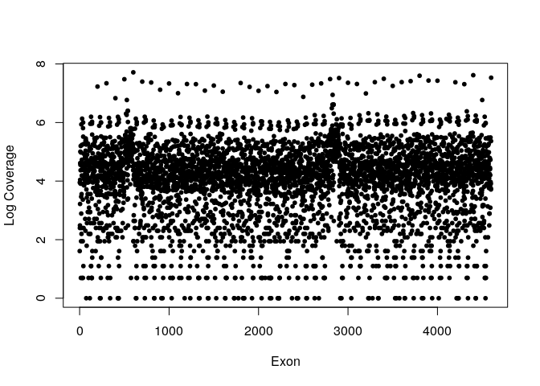
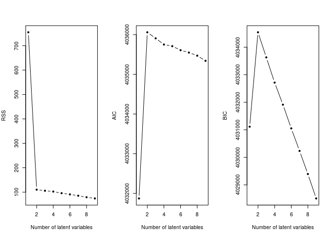

---  
    title: "CODEX2 Notebook"  
    author: "Gene Urrutia"  
    date: "2017-12-08"
    output:  
      html_document:  
        keep_md: true 
---  

#Load CODEX2 library

```r
library(CODEX2, quietly=TRUE)
```

#Get bam file directories, sample names from .txt file, and exonic positions from .bed file.


```r
library(WES.1KG.WUGSC) # Load Toy data from the 1000 Genomes Project.
dirPath <- system.file("extdata", package = "WES.1KG.WUGSC")
bamFile <- list.files(dirPath, pattern = '*.bam$')
bamdir <- file.path(dirPath, bamFile)
sampname <- as.matrix(read.table(file.path(dirPath, "sampname")))
bedFile <- file.path(dirPath, "chr22_400_to_500.bed")
chr <- 22
bambedObj <- getbambed(bamdir = bamdir, bedFile = bedFile, 
                       sampname = sampname, projectname = "CODEX_demo", chr)
bamdir <- bambedObj$bamdir; sampname <- bambedObj$sampname
ref <- bambedObj$ref; projectname <- bambedObj$projectname; chr <- bambedObj$chr
```


#Get read depth coverage


```r
coverageObj <- getcoverage(bambedObj, mapqthres = 20)
Y <- coverageObj$Y; readlength <- coverageObj$readlength
plot(x= seq_along(Y), y = log(Y), xlab="Exon", ylab= "Log Coverage", pch=20)
```

<!-- -->


#Get GC content and mappability


```r
gc <- getgc(chr, ref)
plot(x= seq_along(gc), y = gc, xlab="Exon", ylab= "GC%", pch=20)
```

<!-- -->


#Get mappability

```r
mapp <- getmapp(chr, ref)
plot(x= seq_along(mapp), y =mapp, xlab="Exon", ylab="Mappability", pch=20)
```

<!-- -->


#Quality control

```r
qcObj <- qc(Y, sampname, chr, ref, mapp, gc, cov_thresh = c(20, 4000), 
            length_thresh = c(20, 2000), mapp_thresh = 0.9, gc_thresh = c(20, 80))
```

```
## Excluded 21 exons due to extreme coverage.
```

```
## Excluded 0 exons due to extreme exonic length.
```

```
## Excluded 3 exons due to extreme mappability.
```

```
## Excluded 0 exons due to extreme GC content.
```

```
## After taking union, excluded 23 out of 100 exons in QC.
```

```r
Y_qc <- qcObj$Y_qc; sampname_qc <- qcObj$sampname_qc; gc_qc <- qcObj$gc_qc
mapp_qc <- qcObj$mapp_qc; ref_qc <- qcObj$ref_qc; qcmat <- qcObj$qcmat
# write.table(qcmat, file = paste(projectname, '_', chr, '_qcmat', '.txt', sep=''),
#             sep='\t', quote=FALSE, row.names=FALSE)
```


#Normalization with normal controls.  This is the step which differentiates CODEX2 from CODEX.  Only normal (negative) samples are used to determine the latent normalization factors.


```r
normObj <- normalize2(Y_qc, gc_qc, K = 1:9, normal_index=seq(1,45,2))
Yhat <- normObj$Yhat; AIC <- normObj$AIC; BIC <- normObj$BIC
RSS <- normObj$RSS; K <- normObj$K
```


#Choose the number of latent factors


```r
choiceofK(AIC, BIC, RSS, K, filename = paste(projectname, "_", chr, 
                                             "_choiceofK", ".pdf", sep = ""))
```

```
## png 
##   2
```

```r
par(mfrow = c(1, 3))
plot(K, RSS, type = "b", xlab = "Number of latent variables", pch=20)
plot(K, AIC, type = "b", xlab = "Number of latent variables", pch=20)
plot(K, BIC, type = "b", xlab = "Number of latent variables", pch=20)
```

<!-- -->


#Poisson-likelihood segmentation.  CODEX2 produces 4 results where CODEX produced 1.

```r
optK = K[which.max(BIC)]
finalcall <- segment(Y_qc, Yhat, optK = optK, K = K, sampname_qc,
                     ref_qc, chr, lmax = 200, mode = "fraction")
head(finalcall)
```

```
##  sample_name chr  cnv   st_bp      ed_bp      length_kb st_exon ed_exon
##  "NA12761"   "22" "dup" "21990671" "22035729" "45.059"  "25"    "32"   
##  "NA18990"   "22" "dup" "22312814" "22326373" "13.56"   "60"    "72"   
##  "NA18990"   "22" "del" "21346453" "22300470" "954.018" "1"     "59"   
##  "NA19210"   "22" "del" "22329961" "22599725" "269.765" "75"    "76"   
##  raw_cov norm_cov copy_no lratio   mBIC    
##  "838"   "705"    "2.377" "11.817" "0.836" 
##  "1382"  "987"    "2.8"   "70.185" "59.583"
##  "6268"  "6873"   "1.824" "27.476" "82.724"
##  "140"   "205"    "1.366" "11.612" "2.944"
```

```r
# write.table(finalcall, file = paste(projectname, '_', chr, '_', optK,
#                                     '_CODEX_frac.txt', sep=''), sep='\t', 
#             quote=FALSE, row.names=FALSE)
# save.image(file = paste(projectname, '_', chr, '_image', '.rda', sep=''),
# compress='xz')
```
