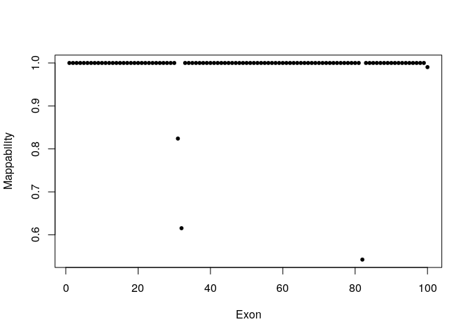
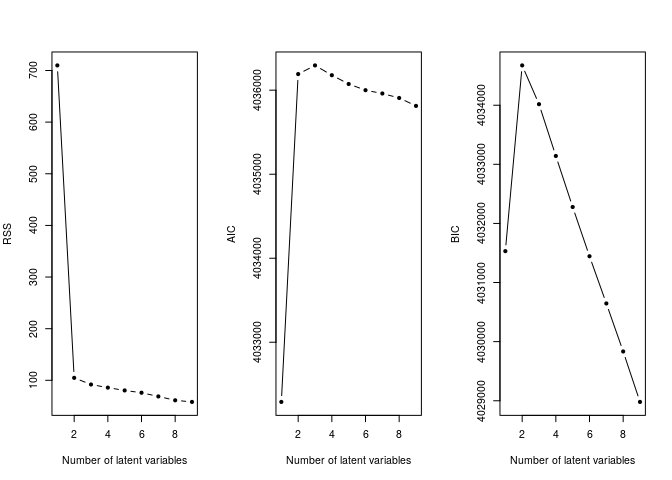

---  
    title: "Codex Example"  
    author: "Gene"  
    date: "2017-12-07"
    output:  
      html_document:  
        keep_md: true 
---  

#install and load packages

```r
#install.packages("devtools", repos = "http://archive.linux.duke.edu/cran/", quiet=T)
library(devtools, quietly=T)
#install_github("yuchaojiang/CODEX/package")
library(CODEX, quietly=T)
#install_github("WES.1KG.WUGSC")
#library(WES.1KG.WUGSC, quietly=T) # Load Toy data from the 1000 Genomes Project.
#source("https://bioconductor.org/biocLite.R")
#biocLite("WES.1KG.WUGSC")
library(WES.1KG.WUGSC, quietly=T)
```

#Get bam file directories, sample names from .txt file, and exonic positions from .bed file.


```r
dirPath <- system.file("extdata", package = "WES.1KG.WUGSC")
bamFile <- list.files(dirPath, pattern = '*.bam$')
bamdir <- file.path(dirPath, bamFile)
sampname <- as.matrix(read.table(file.path(dirPath, "sampname")))
bedFile <- file.path(dirPath, "chr22_400_to_500.bed")
chr <- 22
bambedObj <- getbambed(bamdir = bamdir, bedFile = bedFile, 
                       sampname = sampname, projectname = "CODEX_demo", chr)
bamdir <- bambedObj$bamdir; sampname <- bambedObj$sampname
ref <- bambedObj$ref; projectname <- bambedObj$projectname; chr <- bambedObj$chr

bambedObj$ref[1:10,]
```

```
## IRanges object with 10 ranges and 0 metadata columns:
##            start       end     width
##        <integer> <integer> <integer>
##    [1]  21345867  21346168       302
##    [2]  21346453  21346708       256
##    [3]  21347033  21347243       211
##    [4]  21347901  21348093       193
##    [5]  21348163  21348608       446
##    [6]  21348797  21349066       270
##    [7]  21349109  21349365       257
##    [8]  21349985  21350451       467
##    [9]  21350935  21351305       371
##   [10]  21351471  21351687       217
```


#Get depth of coverage for each exon across all samples from whole exome sequencing files.

```r
coverageObj <- getcoverage(bambedObj, mapqthres = 20)
Y <- coverageObj$Y; readlength <- coverageObj$readlength
plot(x= seq_along(Y), y = log(Y), xlab="Exon", ylab= "Log Coverage", pch=20)
```

<!-- -->


#Compute GC content for each exon. Will be later used in QC procedure and normalization.


```r
gc <- getgc(chr, ref)
plot(x= seq_along(gc), y = gc, xlab="Exon", ylab= "GC%", pch=20)
```

<!-- -->


#Compute mappability for each exon. To save running time, take values from pre-computed results. Will be later used in QC procedure.


```r
mapp <- getmapp(chr, ref)
plot(x= seq_along(mapp), y =mapp, xlab="Exon", ylab="Mappability", pch=20)
```

<!-- -->


#Apply a quality control procedure to the depth of coverage matrix both sample-wise and exon-wise before normalization.


```r
qcObj <- qc(Y, sampname, chr, ref, mapp, gc, cov_thresh = c(20, 4000), 
    length_thresh = c(20, 2000), mapp_thresh = 0.9, gc_thresh = c(20, 80))
```

```
## Excluded 21 exons due to extreme coverage.
```

```
## Excluded 0 exons due to extreme exonic length.
```

```
## Excluded 3 exons due to extreme mappability.
```

```
## Excluded 0 exons due to extreme GC content.
```

```
## After taking union, excluded 23 out of 100 exons in QC.
```

```r
Y_qc <- qcObj$Y_qc; sampname_qc <- qcObj$sampname_qc; gc_qc <- qcObj$gc_qc
mapp_qc <- qcObj$mapp_qc; ref_qc <- qcObj$ref_qc; qcmat <- qcObj$qcmat
write.table(qcmat, file = paste(projectname, '_', chr, '_qcmat', '.txt', sep=''), sep='\t', quote=FALSE, row.names=FALSE)
qcmat[1:10,]
```

```
##       chr start_bp   end_bp pass median_depth pass_depth length_kb
##  [1,]  22 21345867 21346168    0          9.0          0     0.302
##  [2,]  22 21346453 21346708    1         53.5          1     0.256
##  [3,]  22 21347033 21347243    0         12.0          0     0.211
##  [4,]  22 21347901 21348093    0         20.0          0     0.193
##  [5,]  22 21348163 21348608    1         27.0          1     0.446
##  [6,]  22 21348797 21349066    1         63.5          1     0.270
##  [7,]  22 21349109 21349365    1         95.5          1     0.257
##  [8,]  22 21349985 21350451    1        151.5          1     0.467
##  [9,]  22 21350935 21351305    1         94.5          1     0.371
## [10,]  22 21351471 21351687    1         57.0          1     0.217
##       pass_length mapp pass_mapp    gc pass_gc
##  [1,]           1    1         1 64.24       1
##  [2,]           1    1         1 60.55       1
##  [3,]           1    1         1 64.93       1
##  [4,]           1    1         1 63.73       1
##  [5,]           1    1         1 67.94       1
##  [6,]           1    1         1 64.07       1
##  [7,]           1    1         1 61.87       1
##  [8,]           1    1         1 62.74       1
##  [9,]           1    1         1 61.19       1
## [10,]           1    1         1 63.13       1
```


#Fit a Poisson log-linear model that normalizes the read depth data from whole exome sequencing. Includes terms that specifically remove biases due to GC content, exon capture and amplification efficiency, and latent systemic artifacts.


```r
normObj <- normalize(Y_qc, gc_qc, K = 1:9)
Yhat <- normObj$Yhat; AIC <- normObj$AIC; BIC <- normObj$BIC
RSS <- normObj$RSS; K <- normObj$K
```


#Plot RSS, AIC, and BIC by number of latent variables.  


```r
# filename <- paste(projectname, "_", chr, "_choiceofK", ".pdf", sep = "")
# Kmax <- length(AIC)
par(mfrow = c(1, 3))
plot(K, RSS, type = "b", xlab = "Number of latent variables", pch=20)
plot(K, AIC, type = "b", xlab = "Number of latent variables", pch=20)
plot(K, BIC, type = "b", xlab = "Number of latent variables", pch=20)
```

<!-- -->


#Recursive segmentation algorithm for CNV detection and genotyping, using normalized read depth from whole exome sequencing.


```r
optK = K[which.max(BIC)]
finalcall <- segment(Y_qc, Yhat, optK = optK, K = K, sampname_qc,
    ref_qc, chr, lmax = 200, mode = "integer")
```


```r
finalcall
```

```
##  sample_name chr  cnv   st_bp      ed_bp      length_kb st_exon ed_exon
##  "NA18990"   "22" "dup" "22312814" "22326373" "13.56"   "60"    "72"   
##  raw_cov norm_cov copy_no lratio  mBIC    
##  "1382"  "1000"   "3"     "60.33" "49.728"
```


