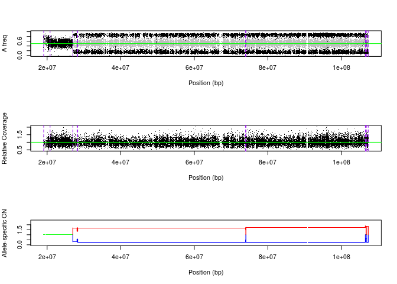
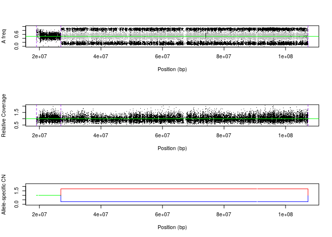

---
    title: "Falcon Notebook"
    author: "Gene Urrutia"  
    date: "2017-12-12"
    output:  
      html_document:  
        keep_md: true 
---  

# This is a demo dataset from relapse genome of neuroblastoma with matched normal
# from Eleveld et al. (Nature Genetics 2015).

# Falcon takes as input germline heterozygous variants, which can be called by 
# GATK or VarScan2.  See [Profiling germline heterozygous loci](https://github.com/yuchaojiang/MARATHON/blob/master/script/germline_het_loci.sh) for details.

#Load Falcon package

```r
library(falcon)
requireNamespace("falcon")
library(repmis)  
library(RCurl)
```

```
## Loading required package: bitops
```
#source additional falcon functions

```r
faclonURL = "https://github.com/yuchaojiang/Canopy/blob/master/instruction"
source(paste0(faclonURL, "/falcon.qc.R?raw=True"))
source(paste0(faclonURL, "/falcon.output.R?raw=True"))
```

# download the primary and relapse germline heterozygous variants data (This data was generated using "germline_het_loci.sh" script)

```r
gitUrl = "https://github.com/yuchaojiang/MARATHON/blob/master/data"
source_data(paste0(gitUrl, "/relapse.rda?raw=True"))
```

```
## Downloading data from: https://github.com/yuchaojiang/MARATHON/blob/master/data/relapse.rda?raw=True
```

```
## SHA-1 hash of the downloaded data file is:
## 7da780f713b1ad1d86c3564d363dfda75c3312ec
```

```
## [1] "relapse"
```

```r
coverageData = relapse
```

# calculate depth ratio (total read counts of tumor versus normal)

```r
rdep=sum(coverageData$Tumor_ReadCount_Total)/sum(coverageData$Normal_ReadCount_Total)
```


# Restrict our analysis to chromosome 14, where a copy-neutral loss of heterozygosity 
# has been previously reported.

```r
chr = 14
coverageChr=coverageData[which(coverageData[,'Chromosome']==chr),]
```
 
 
# remove variants with missing genotype

```r
nonMissing1 = coverageChr[,'Match_Norm_Seq_Allele1']!=' '
nonMissing2 = coverageChr[,'Match_Norm_Seq_Allele2']!=' '
nonMissing3 = coverageChr[,'Reference_Allele']!=' '
nonMissing4 = coverageChr[,'TumorSeq_Allele1']!=' '
nonMissing5 = coverageChr[,'TumorSeq_Allele2']!=' '
coverageChr=coverageChr[nonMissing1 & nonMissing2 & nonMissing3 & nonMissing4 & nonMissing5,]
```
  
# get germline heterozygous loci (normal allele1 != normal allele2)

```r
coverageChrHet=coverageChr[(as.matrix(coverageChr[,'Match_Norm_Seq_Allele1'])!=as.matrix(coverageChr[,'Match_Norm_Seq_Allele2'])),]
```
  

# QC procedures to remove false neg and false pos variants.
# The thresholds can be adjusted.

# remove indels (this can be relaxed but we think indels are harder to call than SNPs)

```r
indelThresh = 1
indel.filter1=nchar(as.matrix(coverageChrHet[,'Reference_Allele']))<=indelThresh
indel.filter2=nchar(as.matrix(coverageChrHet[,'Match_Norm_Seq_Allele1']))<=indelThresh
indel.filter3=nchar(as.matrix(coverageChrHet[,'Match_Norm_Seq_Allele2']))<=indelThresh
indel.filter4=nchar(as.matrix(coverageChrHet[,'TumorSeq_Allele1']))<=indelThresh
indel.filter5=nchar(as.matrix(coverageChrHet[,'TumorSeq_Allele2']))<=indelThresh
coverageChrHet=coverageChrHet[indel.filter1 & indel.filter2 & indel.filter3 & indel.filter4 & indel.filter5,]
```

# Filter on coverage: total number of reads greater than 30 in both tumor and normal


```r
coverageThresh = 30
depth.filter1=(coverageChrHet[,"Normal_ReadCount_Ref"]+coverageChrHet[,"Normal_ReadCount_Alt"])>=coverageThresh
depth.filter2=(coverageChrHet[,"Tumor_ReadCount_Ref"]+coverageChrHet[,"Tumor_ReadCount_Alt"])>=coverageThresh
coverageChrHet=coverageChrHet[depth.filter1 & depth.filter2,]
```
  
  
  #########################
  # Generate FALCON input.
  #########################
  
# Data frame with four columns: tumor ref, tumor alt, normal ref, normal alt.

```r
readMatrix=as.data.frame(coverageChrHet[,c('Tumor_ReadCount_Ref',
                                                   'Tumor_ReadCount_Alt',
                                                   'Normal_ReadCount_Ref',
                                                   'Normal_ReadCount_Alt')])
colnames(readMatrix)=c('AT','BT','AN','BN')
dim(readMatrix); dim(coverageChrHet)
```

```
## [1] 24617     4
```

```
## [1] 24617    14
```
  

# Run FALCON and view results


```r
tauhat = getChangepoints(readMatrix)
```

```
## Number of loci: 24617 
## Scanning region between variants 1 to 1200 for change-points ... 
##   Candidate change-point(s): 611 
##   Adding 611 to current change-point list.
##   Current change-point list: 611 
## Scanning region between variants 1001 to 2200 for change-points ... 
##  No change-point found in this region.
## Scanning region between variants 2001 to 3200 for change-points ... 
##  No change-point found in this region.
## Scanning region between variants 3001 to 4200 for change-points ... 
##   Candidate change-point(s): 3451 3621 3631 
##   Adding 3451 3621 3631 to current change-point list.
##   Current change-point list: 611 3451 3621 3631 
## Scanning region between variants 4001 to 5200 for change-points ... 
##  No change-point found in this region.
## Scanning region between variants 5001 to 6200 for change-points ... 
##  No change-point found in this region.
## Scanning region between variants 6001 to 7200 for change-points ... 
##  No change-point found in this region.
## Scanning region between variants 7001 to 8200 for change-points ... 
##  No change-point found in this region.
## Scanning region between variants 8001 to 9200 for change-points ... 
##  No change-point found in this region.
## Scanning region between variants 9001 to 10200 for change-points ... 
##  No change-point found in this region.
## Scanning region between variants 10001 to 11200 for change-points ... 
##  No change-point found in this region.
## Scanning region between variants 11001 to 12200 for change-points ... 
##  No change-point found in this region.
## Scanning region between variants 12001 to 13200 for change-points ... 
##  No change-point found in this region.
## Scanning region between variants 13001 to 14200 for change-points ... 
##  No change-point found in this region.
## Scanning region between variants 14001 to 15200 for change-points ... 
##   Candidate change-point(s): 14361 14371 14381 14391 
##   Adding 14361 14371 14381 14391 to current change-point list.
##   Current change-point list: 611 3451 3621 3631 14361 14371 14381 14391 
## Scanning region between variants 15001 to 16200 for change-points ... 
##  No change-point found in this region.
## Scanning region between variants 16001 to 17200 for change-points ... 
##  No change-point found in this region.
## Scanning region between variants 17001 to 18200 for change-points ... 
##  No change-point found in this region.
## Scanning region between variants 18001 to 19200 for change-points ... 
##  No change-point found in this region.
## Scanning region between variants 19001 to 20200 for change-points ... 
##  No change-point found in this region.
## Scanning region between variants 20001 to 21200 for change-points ... 
##  No change-point found in this region.
## Scanning region between variants 21001 to 22200 for change-points ... 
##  No change-point found in this region.
## Scanning region between variants 22001 to 23200 for change-points ... 
##  No change-point found in this region.
## Scanning region between variants 23001 to 24200 for change-points ... 
##  No change-point found in this region.
## Scanning region between variants 24001 to 24617 for change-points ... 
##   Candidate change-point(s): 24351 24361 24381 24411 
##   Adding 24351 24361 24381 24411 to current change-point list.
##   Current change-point list: 611 3451 3621 3631 14361 14371 14381 14391 24351 24361 24381 24411 
## 
## Estimated change-points of the whole sequence: 611 3451 3621 3631 14361 14371 14381 14391 24351 24361 24381 24411
```

```r
cn = getASCN(readMatrix, tauhat=tauhat, rdep = rdep, threshold = 0.3)
```

# Chromosomal view of segmentation results. (save image file.)

```r
  #pdf(file=paste('falcon.relapse.',chr,'.pdf',sep=''),width=5,height=8)
  view(cn, pos=coverageChrHet[,'Start_position'], rdep = rdep)
```

<!-- -->

```r
  #dev.off()
 #save.image(file=paste('falcon_relapse_',chr,'.rda',sep=''))
```


# Further curate FALCON's segmentation.
  
  
# From the figure above, we see that:
# (1) There are small segments that need to be removed;
# (2) Consecutive segments with similar allelic copy number states need to be combined.
  

```r
if(length(tauhat)>0){
  length.thres=10^6  # Threshold for length of segments, in base pair.
  delta.cn.thres=0.3  # Threshold of absolute copy number difference between consecutive segments.
  falcon.qc.list = falcon.qc(readMatrix = readMatrix,
                             tauhat = tauhat,
                             cn = cn,
                             st_bp = coverageChrHet[,"Start_position"],
                             end_bp = coverageChrHet[,"End_position"],
                             rdep = rdep,
                             length.thres = length.thres,
                             delta.cn.thres = delta.cn.thres)
  tauhat=falcon.qc.list$tauhat
  cn=falcon.qc.list$cn
}
```


# Chromosomal view of QC'ed segmentation results.

```r
#pdf(file=paste('falcon.relapse.qc.',chr,'.pdf',sep=''),width=5,height=8)
view(cn,pos=coverageChrHet[,'Start_position'], rdep = rdep)
```

<!-- -->

```r
#  dev.off()
```
  

# Generate Canopy's input with s.d. measurement.

# This is to generate table output including genomic locations for 
# segment boudaries.
# For Canopy's input, we use Bootstrap-based method to estimate the
# standard deviations for the allele-specific copy numbers.


```r
  falcon.output=falcon.output(readMatrix = readMatrix,
                              tauhat = tauhat,
                              cn = cn,
                              st_bp = coverageChrHet[,"Start_position"],
                              end_bp = coverageChrHet[,"End_position"],
                              nboot = 5000)
```

```
## Running bootstrap for segment 2 ...
```

```r
  falcon.output = cbind(chr=rep(chr,nrow(falcon.output)), falcon.output)
  falcon.output
```

```
##      chr st_snp end_snp    st_bp    end_bp Minor_copy Major_copy Minor.sd
## [1,]  14      1    3451 19066021  26963559      1.000      1.000       NA
## [2,]  14   3451   24617 26963559 107287663      0.277      1.719    9e-04
##      Major.sd
## [1,]       NA
## [2,]   0.0033
```

```r
  #write.table(falcon.output, file=paste('faclon.relapse.output.',chr,'.txt',sep=''), col.names =T, row.names = F, sep='\t', quote = F)
```

